# FightSight Entity Relationship Diagram

**Version**: 1.0
**Database**: PostgreSQL 16 with UUIDs

---

## Visual ERD (Mermaid Diagram)

```mermaid
erDiagram
    users ||--o{ videos : "uploads"
    users ||--o{ analysis_sessions : "owns"
    users ||--o{ fighter_profiles : "creates"

    videos ||--o{ analysis_sessions : "analyzed_in"

    analysis_sessions ||--o{ session_fighters : "has"
    analysis_sessions ||--o{ strike_events : "contains"
    analysis_sessions ||--o{ combinations : "contains"
    analysis_sessions ||--o{ analysis_reports : "generates"

    fighter_profiles ||--o{ session_fighters : "links_to"

    session_fighters ||--o{ strike_events : "throws (thrower)"
    session_fighters ||--o{ strike_events : "receives (receiver)"
    session_fighters ||--o{ combinations : "performs"

    combinations ||--o{ combination_strikes : "consists_of"
    strike_events ||--o{ combination_strikes : "part_of"

    users {
        uuid id PK
        string email UK
        string password_hash
        string full_name
        string role
        boolean email_verified
        timestamp last_login_at
        timestamp created_at
        timestamp updated_at
        timestamp deleted_at
    }

    videos {
        uuid id PK
        uuid user_id FK
        string original_filename
        string storage_path
        bigint file_size_bytes
        string mime_type
        decimal duration_seconds
        int width
        int height
        decimal fps
        string upload_status
        timestamp created_at
        timestamp updated_at
        timestamp deleted_at
    }

    analysis_sessions {
        uuid id PK
        uuid video_id FK
        uuid user_id FK
        enum sport_type
        int round_count
        enum status
        int progress_percentage
        timestamp started_at
        timestamp completed_at
        timestamp failed_at
        text error_message
        decimal total_cost_usd
        string llm_provider
        string llm_model
        int total_llm_api_calls
        int total_frames_analyzed
        int total_strikes_detected
        int total_combinations_detected
        int processing_time_seconds
        timestamp created_at
        timestamp updated_at
        timestamp deleted_at
    }

    fighter_profiles {
        uuid id PK
        uuid created_by_user_id FK
        string name
        string nickname
        enum default_stance
        string weight_class
        string team_gym
        text notes
        timestamp created_at
        timestamp updated_at
        timestamp deleted_at
    }

    session_fighters {
        uuid id PK
        uuid analysis_session_id FK
        uuid fighter_profile_id FK
        string fighter_label UK
        string corner_color
        string display_name
        enum stance
        int total_strikes_thrown
        int total_strikes_landed
        int total_strikes_received
        timestamp created_at
        timestamp updated_at
    }

    strike_events {
        uuid id PK
        uuid analysis_session_id FK
        decimal timestamp_seconds
        int frame_number
        int round_number
        uuid thrower_id FK
        uuid receiver_id FK
        enum thrower_stance
        enum strike_category
        string technique
        string modifier
        enum target_zone
        enum outcome
        string range
        string initiated_from
        boolean is_part_of_combination
        int position_in_combination
        string frame_storage_path
        decimal detection_confidence
        decimal classification_confidence
        timestamp created_at
    }

    combinations {
        uuid id PK
        uuid analysis_session_id FK
        uuid thrower_id FK
        decimal start_timestamp_seconds
        decimal end_timestamp_seconds
        decimal duration_seconds
        int strike_count
        string combination_name
        int strikes_landed
        int strikes_missed
        timestamp created_at
    }

    combination_strikes {
        uuid id PK
        uuid combination_id FK
        uuid strike_event_id FK
        int position_in_sequence UK
        timestamp created_at
    }

    analysis_reports {
        uuid id PK
        uuid analysis_session_id FK
        string report_type
        string report_format
        jsonb content_json
        text content_text
        array key_insights
        array strengths
        array areas_for_improvement
        string generated_by_llm_provider
        string generated_by_llm_model
        decimal generation_cost_usd
        timestamp created_at
        timestamp updated_at
    }
```



---

## Relationship Cardinality

### One-to-Many Relationships

| Parent | Child | Relationship | Delete Rule |
|--------|-------|--------------|-------------|
| users | videos | 1:N | CASCADE |
| users | analysis_sessions | 1:N | CASCADE |
| users | fighter_profiles | 1:N | SET NULL |
| videos | analysis_sessions | 1:N | CASCADE |
| analysis_sessions | session_fighters | 1:2 (exactly 2) | CASCADE |
| analysis_sessions | strike_events | 1:N | CASCADE |
| analysis_sessions | combinations | 1:N | CASCADE |
| analysis_sessions | analysis_reports | 1:N | CASCADE |
| fighter_profiles | session_fighters | 1:N (optional) | SET NULL |
| session_fighters | strike_events (thrower) | 1:N | CASCADE |
| session_fighters | strike_events (receiver) | 1:N | CASCADE |
| session_fighters | combinations | 1:N | CASCADE |

### Many-to-Many Relationships

| Entity A | Entity B | Junction Table | Notes |
|----------|----------|----------------|-------|
| combinations | strike_events | combination_strikes | Ordered (position_in_sequence) |

---

## Key Constraints Summary

### Primary Keys
- All tables use UUID with `uuid_generate_v4()` default

### Unique Constraints
- `users.email` - One email per account
- `session_fighters(analysis_session_id, fighter_label)` - Exactly 2 fighters per session
- `combination_strikes(combination_id, position_in_sequence)` - No duplicate positions
- `combination_strikes(combination_id, strike_event_id)` - Strike appears once per combo

### Foreign Key Constraints
All foreign keys have explicit `ON DELETE` rules:
- **CASCADE**: Delete child when parent deleted (most relationships)
- **SET NULL**: Keep child, nullify reference (fighter_profiles)

---

## Indexes Strategy

### Primary Access Patterns

**Get all strikes for a session (most common query)**:
- `strike_events(analysis_session_id)`
- `strike_events(analysis_session_id, timestamp_seconds)` - Composite for timeline

**Get fighter statistics**:
- `strike_events(thrower_id)`
- `strike_events(receiver_id)`
- `strike_events(thrower_id, technique)` - Composite for technique breakdown

**Filter strikes by attributes**:
- `strike_events(technique)`
- `strike_events(outcome)`
- `strike_events(target_zone)`

**Session lookup**:
- `analysis_sessions(user_id)`
- `analysis_sessions(video_id)`
- `analysis_sessions(status)` - For job processing

**User lookup**:
- `users(email)` - Login
- `videos(user_id)` - User's videos

---

## Data Flow Diagram

```
┌──────────────────────────────────────────────────────────┐
│ 1. USER UPLOADS VIDEO                                    │
└────────────────┬─────────────────────────────────────────┘
                 │
                 ▼
         ┌───────────────┐
         │    videos     │ (status: uploading → completed)
         └───────┬───────┘
                 │
                 ▼
┌──────────────────────────────────────────────────────────┐
│ 2. CREATE ANALYSIS SESSION                               │
└────────────────┬─────────────────────────────────────────┘
                 │
                 ▼
    ┌────────────────────────┐
    │  analysis_sessions     │ (status: pending)
    └───────────┬────────────┘
                │
                ▼
┌──────────────────────────────────────────────────────────┐
│ 3. CREATE SESSION FIGHTERS                               │
└────────────────┬─────────────────────────────────────────┘
                 │
                 ▼
    ┌────────────────────────┐
    │  session_fighters      │ (fighter_a, fighter_b)
    └───────────┬────────────┘
                │
                ▼
┌──────────────────────────────────────────────────────────┐
│ 4. PROCESS VIDEO → DETECT STRIKES                        │
└────────────────┬─────────────────────────────────────────┘
                 │
                 ▼
    ┌────────────────────────┐
    │   strike_events        │ (60+ rows per session)
    │   - timestamp          │
    │   - technique          │
    │   - outcome            │
    │   - thrower/receiver   │
    └───────────┬────────────┘
                │
                ▼
┌──────────────────────────────────────────────────────────┐
│ 5. DETECT COMBINATIONS                                   │
└────────────────┬─────────────────────────────────────────┘
                 │
                 ▼
    ┌────────────────────────┐
    │   combinations         │
    └───────────┬────────────┘
                │
                ▼
    ┌────────────────────────┐
    │ combination_strikes    │ (junction table)
    └───────────┬────────────┘
                │
                ▼
┌──────────────────────────────────────────────────────────┐
│ 6. GENERATE REPORT                                       │
└────────────────┬─────────────────────────────────────────┘
                 │
                 ▼
    ┌────────────────────────┐
    │  analysis_reports      │
    │  - key_insights        │
    │  - strengths           │
    │  - recommendations     │
    └───────────┬────────────┘
                │
                ▼
┌──────────────────────────────────────────────────────────┐
│ 7. UPDATE SESSION STATUS                                 │
└────────────────┬─────────────────────────────────────────┘
                 │
                 ▼
    ┌────────────────────────┐
    │  analysis_sessions     │ (status: completed)
    │  - total_cost_usd      │
    │  - processing_time     │
    └────────────────────────┘
```

---

## Normalization Analysis

### ✅ First Normal Form (1NF)
- All attributes are atomic
- Each column contains single values
- No repeating groups
- Primary keys defined

### ✅ Second Normal Form (2NF)
- In 1NF
- All non-key attributes fully dependent on primary key
- No partial dependencies (all PKs are single UUID columns)

### ✅ Third Normal Form (3NF)
- In 2NF
- No transitive dependencies
- All non-key attributes depend only on the primary key

**Acceptable Denormalization for Performance**:
- `session_fighters.total_strikes_*` - Calculated aggregates (updated after analysis)
- `combinations.strike_count` - Derived from junction table count
- `combinations.strikes_landed/missed` - Cached aggregation

These are intentional trade-offs for read performance in analytics queries.

---

## PostgreSQL-Specific Features

### Custom ENUM Types
All enums mapped to PostgreSQL native types:
- `stance_type`
- `strike_category`
- `target_zone`
- `strike_outcome`
- `combat_sport`
- `analysis_status`

### JSONB for Flexible Data
- `analysis_reports.content_json` - Structured report data with GIN index support

### Array Types
- `analysis_reports.key_insights` - Text array
- `analysis_reports.strengths` - Text array
- `analysis_reports.areas_for_improvement` - Text array

### UUID Generation
- `uuid_generate_v4()` - Database-generated UUIDs via uuid-ossp extension

### Timestamp with Time Zone
- All timestamps use `TIMESTAMPTZ(6)` for proper timezone handling

---

## Sample Data Flow

### Creating a New Analysis

```typescript
// 1. Insert video
const video = await prisma.video.create({
  data: {
    userId: user.id,
    originalFilename: "sparring-session.mp4",
    storagePath: "/uploads/xyz.mp4",
    fileSizeBytes: 50000000,
    mimeType: "video/mp4",
    durationSeconds: 240.5,
    width: 1920,
    height: 1080,
    fps: 30,
    uploadStatus: "completed"
  }
});

// 2. Create analysis session
const session = await prisma.analysisSession.create({
  data: {
    videoId: video.id,
    userId: user.id,
    sportType: "boxing",
    roundCount: 3,
    status: "pending"
  }
});

// 3. Create fighters
const fighterA = await prisma.sessionFighter.create({
  data: {
    analysisSessionId: session.id,
    fighterLabel: "fighter_a",
    displayName: "Red Corner",
    stance: "orthodox",
    cornerColor: "red"
  }
});

const fighterB = await prisma.sessionFighter.create({
  data: {
    analysisSessionId: session.id,
    fighterLabel: "fighter_b",
    displayName: "Blue Corner",
    stance: "southpaw",
    cornerColor: "blue"
  }
});

// 4. Process video and insert strikes
const strike = await prisma.strikeEvent.create({
  data: {
    analysisSessionId: session.id,
    throwerId: fighterA.id,
    receiverId: fighterB.id,
    timestampSeconds: 12.450,
    frameNumber: 374,
    roundNumber: 1,
    throwerStance: "orthodox",
    strikeCategory: "hand",
    technique: "jab",
    modifier: "lead",
    targetZone: "head",
    outcome: "landed_clean",
    range: "mid_range",
    detectionConfidence: 0.92,
    classificationConfidence: 0.87
  }
});

// 5. Create combination
const combo = await prisma.combination.create({
  data: {
    analysisSessionId: session.id,
    throwerId: fighterA.id,
    startTimestampSeconds: 12.450,
    endTimestampSeconds: 13.100,
    durationSeconds: 0.650,
    strikeCount: 3,
    combinationName: "1-2-3 combo",
    strikesLanded: 2,
    strikesMissed: 1
  }
});

// 6. Link strikes to combination
await prisma.combinationStrike.createMany({
  data: [
    { combinationId: combo.id, strikeEventId: strike1.id, positionInSequence: 1 },
    { combinationId: combo.id, strikeEventId: strike2.id, positionInSequence: 2 },
    { combinationId: combo.id, strikeEventId: strike3.id, positionInSequence: 3 }
  ]
});

// 7. Generate report
await prisma.analysisReport.create({
  data: {
    analysisSessionId: session.id,
    reportType: "summary",
    reportFormat: "json",
    contentJson: { /* report data */ },
    keyInsights: ["Strong jab presence", "Good head movement"],
    strengths: ["Effective combinations"],
    areasForImprovement: ["Body shot frequency"],
    generatedByLlmProvider: "anthropic",
    generatedByLlmModel: "claude-3-5-sonnet-20241022",
    generationCostUsd: 0.15
  }
});

// 8. Update session status
await prisma.analysisSession.update({
  where: { id: session.id },
  data: {
    status: "completed",
    completedAt: new Date(),
    totalCostUsd: 1.45,
    totalStrikesDetected: 62,
    totalCombinationsDetected: 8,
    processingTimeSeconds: 21
  }
});
```

---

## Common Queries

See [database-schema.md](./database-schema.md#sample-queries) for detailed SQL examples.

---

**Document Version**: 1.0
**Last Updated**: 2025-11-09
**Designed By**: Winston (Architect)
