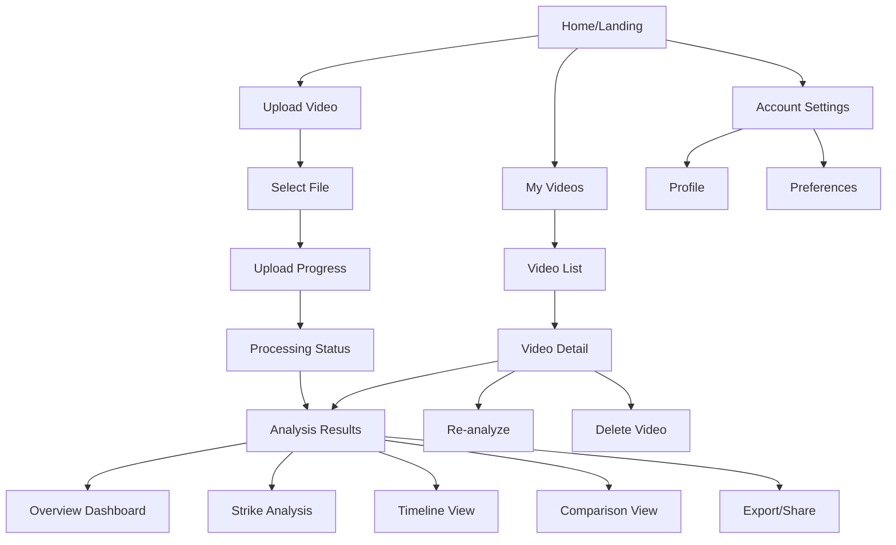

# FightSight UI/UX Specification

This document defines the user experience goals, information architecture, user flows, and visual design specifications for FightSight's user interface. It serves as the foundation for visual design and frontend development, ensuring a cohesive and user-centered experience.

## Overall UX Goals & Principles

### Target User Personas

**1. Amateur Combat Sport Athletes (Primary)**
- Training at local gyms, preparing for competitions
- Need objective feedback on their sparring performance
- Limited access to professional coaching/analysis
- Tech-comfortable, uses smartphones and video for self-improvement
- Age range: 18-35, mix of hobbyists and serious competitors

**2. Coaches & Trainers (Secondary)**
- Work with multiple fighters at various skill levels
- Need efficient tools to review and analyze training footage
- Want data-driven insights to support their coaching decisions
- Value time-saving features (batch analysis, report generation)
- Age range: 25-50, varying tech comfort levels

**3. Gym Owners (Tertiary)**
- Seek value-add services for their members
- May batch-upload multiple sparring sessions
- Focus on ease of use and clear ROI
- Interested in progress tracking over time

### Usability Goals

1. **Ease of first-use:** New users can upload their first video and understand the process within 2 minutes
2. **Clarity of results:** Analysis insights are immediately actionable (no technical jargon)
3. **Progress transparency:** Users always know the status of their video processing
4. **Error resilience:** Clear guidance when uploads fail or videos are unsuitable for analysis
5. **Mobile-friendly:** Core flows work well on mobile devices (upload, check status, view results)

### Design Principles

1. **Fight-focused clarity** - Every screen should feel purpose-built for combat sports, not generic video analysis
2. **Progress over perfection** - Show users their improvement journey, celebrate small wins
3. **Transparency in AI** - Make it clear what the AI can and cannot detect; build trust through honesty
4. **Respectful of the sport** - Use terminology and visuals that honor the discipline of combat sports
5. **Speed matters** - Athletes value their time; minimize friction at every step

### Change Log

| Date | Version | Description | Author |
|------|---------|-------------|--------|
| 2025-12-08 | 1.0 | Initial UI/UX specification | Sally (UX Expert) |

## Information Architecture (IA)

### Site Map / Screen Inventory

### Navigation Structure

**Primary Navigation:**
- Fixed header navigation visible on all screens
- Logo (links to home) on the left
- Main nav items: "Upload" | "My Videos" | "Account"
- Mobile: Collapses to hamburger menu at <768px

**Secondary Navigation:**
- Within Analysis Results: Tab-based navigation for different views (Overview, Strikes, Timeline, etc.)
- Within My Videos: Filter/sort controls (date, status, sport type)

**Breadcrumb Strategy:**
- Display breadcrumbs on deep pages: Home > My Videos > [Video Name] > Analysis
- Not needed on primary pages (Home, Upload)
- Helps users navigate back through video detail → list → home

