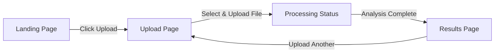

# FightSight MVP UI/UX Specification

**Last Updated:** 2025-12-08
**Author:** Sally (UX Expert)

---

## 🎯 MVP Scope

Build a minimal but usable interface for:
1. Landing page with clear value prop
2. Video upload with progress
3. Processing status display
4. Basic analysis results view

**Out of scope for MVP:** Video history, comparisons, advanced analytics, account settings

---

## 👤 Primary User

**Amateur Combat Sport Athlete**
- Wants to upload sparring video and get feedback
- Needs it to be simple and fast
- Primarily mobile user

**Key UX Principle:** Get from landing → upload → results in under 3 clicks

---

## 🗺️ User Flow (MVP)



**That's it.** Linear flow, no navigation complexity.

---

## 📱 Screen Designs

### 1. Landing Page (`/`)

**Purpose:** Quick intro + immediate CTA to upload

**Layout:**
```
┌─────────────────────────────────────┐
│  🥊 FightSight                      │ ← Simple header
├─────────────────────────────────────┤
│                                     │
│     AI-Powered Sparring Analysis    │ ← H1 headline
│     Upload your video, get insights │ ← Subheadline
│                                     │
│     [Upload Your Video] ←───────────┤ ← Big CTA button
│                                     │
│     ✓ Detect strikes automatically  │
│     ✓ Track performance metrics     │ ← 3 benefit bullets
│     ✓ Get actionable feedback       │
│                                     │
└─────────────────────────────────────┘
```

**Components:**
- Hero section with emoji + brand name
- Clear value proposition (1 sentence)
- Primary CTA button (blue, large, centered)
- 3 bullet points explaining what it does
- Clean background (white or subtle gradient)

**User Actions:**
- Click "Upload Your Video" → navigates to `/upload`

---

### 2. Upload Page (`/upload`)

**Purpose:** File selection and upload with progress tracking

**Layout (Before Upload):**
```
┌─────────────────────────────────────┐
│  🥊 FightSight                      │
├─────────────────────────────────────┤
│                                     │
│  Upload Sparring Video              │ ← H1
│                                     │
│  ┌─────────────────────────────┐   │
│  │                             │   │
│  │         📹                  │   │
│  │   Click or drag to upload   │   │ ← Drop zone
│  │   MP4, MOV, WEBM (max 500MB)│   │
│  │                             │   │
│  └─────────────────────────────┘   │
│                                     │
│  Supported formats:                 │
│  • MP4, MOV, WEBM, AVI              │ ← Help text
│  • Max 500MB                        │
│  • Boxing, Kickboxing, Muay Thai    │
│                                     │
└─────────────────────────────────────┘
```

**Layout (During Upload):**
```
┌─────────────────────────────────────┐
│  🥊 FightSight                      │
├─────────────────────────────────────┤
│                                     │
│  Uploading...                       │
│                                     │
│  sparring-jan-2025.mp4 (156 MB)    │ ← Filename
│                                     │
│  ████████░░░░░░░░░░░░  67%         │ ← Progress bar
│                                     │
└─────────────────────────────────────┘
```

**Components:**
- Header (same as landing)
- File input with drag-and-drop zone
- Progress bar (animated, blue)
- File validation (client-side before upload)
- Error messages (red banner if validation fails)

**User Actions:**
- Select file → validates → shows upload button
- Click upload → progress bar → auto-redirects to processing page

**Edge Cases:**
- File too large: "File must be under 500MB. Try compressing your video."
- Wrong format: "Please select a video file (MP4, MOV, WEBM, AVI)"
- Upload fails: "Upload failed. Check your connection and try again." + Retry button

---

### 3. Processing Status Page (`/upload` - after upload completes)

**Purpose:** Show user that analysis is in progress, prevent anxiety

**Layout:**
```
┌─────────────────────────────────────┐
│  🥊 FightSight                      │
├─────────────────────────────────────┤
│                                     │
│          ⚙️                         │ ← Animated spinner
│                                     │
│     Analyzing Your Video...         │
│                                     │
│  This usually takes 2-5 minutes     │ ← Set expectations
│                                     │
│  We're detecting strikes and        │
│  analyzing your performance.        │ ← Explain what's happening
│  Feel free to close this page.      │
│                                     │
│  ████████████░░░░░░░░░  60%        │ ← Progress (if available)
│                                     │
│  [Upload Another Video]             │ ← Secondary action
│                                     │
└─────────────────────────────────────┘
```

**Components:**
- Animated icon (spinner or loading animation)
- Status message (clear, friendly)
- Progress percentage (if backend provides it)
- Time estimate
- Secondary CTA to upload another video

**User Actions:**
- Wait (polls status every 3 seconds)
- When complete → auto-redirects to results
- If fails → error message + retry button

**States:**
- **Pending:** "Queued for analysis..."
- **Processing:** "Analyzing your video..." + progress %
- **Completed:** "Analysis complete!" → redirect to results
- **Failed:** "Something went wrong. Please try again." + Retry button

---

### 4. Results Page (`/results/[videoId]`)

**Purpose:** Show analysis insights in a clear, actionable way

**Layout:**
```
┌─────────────────────────────────────┐
│  🥊 FightSight              [Home]  │ ← Header with back link
├─────────────────────────────────────┤
│                                     │
│  Analysis Complete ✅               │
│                                     │
│  ┌───────────────────────────────┐ │
│  │  📊 Overview                  │ │
│  │                               │ │
│  │  Total Strikes: 127           │ │
│  │  Punches: 89  |  Kicks: 38    │ │ ← Key metrics (large)
│  │  Duration: 3:24               │ │
│  │  Avg Strike Rate: 37/min      │ │
│  └───────────────────────────────┘ │
│                                     │
│  ┌───────────────────────────────┐ │
│  │  🎯 Strike Breakdown          │ │
│  │                               │ │
│  │  Jab: 45  (35%)               │ │
│  │  Cross: 28  (22%)             │ │ ← Strike types
│  │  Hook: 16  (13%)              │ │
│  │  ...                          │ │
│  └───────────────────────────────┘ │
│                                     │
│  [Upload Another Video]             │ ← Primary CTA
│                                     │
└─────────────────────────────────────┘
```

**Components:**
- Header with "Home" or "Upload Another" link
- Success indicator (checkmark + "Analysis Complete")
- Overview card with big numbers (total strikes, duration, etc.)
- Strike breakdown card (bar chart or simple list)
- Primary CTA to upload another video

**User Actions:**
- View stats (no interaction needed, just reading)
- Click "Upload Another" → go back to upload page
- Click "Home" → go back to landing

**Future Enhancements (NOT MVP):**
- Video player with strike timestamps
- Timeline view
- Comparison with past videos
- Export/download report
- Detailed frame-by-frame analysis

---

## 🎨 Visual Design Specs

### Color Palette

| Color    | Hex Code | Usage                          |
|----------|----------|--------------------------------|
| Primary  | `#2563EB` | Buttons, links, progress bars |
| Success  | `#10B981` | Success messages, checkmarks  |
| Error    | `#EF4444` | Error messages, validation    |
| Warning  | `#F59E0B` | Warnings, cautions            |
| Text     | `#111827` | Primary text                  |
| Text-2   | `#6B7280` | Secondary text, help text     |
| BG       | `#F9FAFB` | Page background               |
| White    | `#FFFFFF` | Cards, modals                 |

### Typography

Using **Tailwind CSS defaults** (system fonts):

- **H1:** 3xl (30px), bold, text-gray-900
- **H2:** 2xl (24px), semibold, text-gray-800
- **Body:** base (16px), normal, text-gray-700
- **Small:** sm (14px), normal, text-gray-500

### Components

**Button (Primary):**
```
bg-blue-600 hover:bg-blue-700
text-white font-medium
py-3 px-6 rounded-lg
transition-colors
```

**Button (Secondary):**
```
bg-gray-200 hover:bg-gray-300
text-gray-700 font-medium
py-2 px-4 rounded-lg
transition-colors
```

**Progress Bar:**
```
w-full bg-gray-200 rounded-full h-2
Inner: bg-blue-600 h-2 rounded-full transition-all
```

**Card:**
```
bg-white rounded-lg shadow-lg p-6
border border-gray-100
```

**Error Message:**
```
bg-red-50 border border-red-200
text-red-700 px-4 py-3 rounded
```

### Spacing

Use Tailwind's spacing scale (4px increments):
- Small gaps: `space-y-2` (8px)
- Medium gaps: `space-y-4` (16px)
- Large gaps: `space-y-6` (24px)
- Section padding: `p-8` (32px)

### Layout

- **Max width:** `max-w-2xl` (672px) for content
- **Centered:** `mx-auto` on all pages
- **Mobile padding:** `px-4` (16px sides)
- **Responsive:** Works 320px - 1920px width

---

## 📋 Implementation Checklist

### Phase 1: Core Structure (Do First)
- [ ] Create shared Layout component with header
- [ ] Improve landing page (remove inline styles, use Tailwind)
- [ ] Add navigation header to all pages
- [ ] Test responsive behavior on mobile

### Phase 2: Results Page (New)
- [ ] Create `/results/[videoId]` page
- [ ] Fetch analysis data from API
- [ ] Display overview metrics card
- [ ] Display strike breakdown card
- [ ] Add "Upload Another" CTA
- [ ] Handle loading/error states

### Phase 3: Polish
- [ ] Add transitions/animations
- [ ] Improve error messages
- [ ] Add loading skeletons
- [ ] Test entire flow end-to-end
- [ ] Mobile testing on real devices

---

## 🚀 Next Steps

1. **Review this spec** - Make sure it matches your vision
2. **Create Layout component** - Shared header/navigation
3. **Build Results page** - The missing piece for MVP
4. **Polish existing pages** - Landing and upload improvements
5. **Test the full flow** - Landing → Upload → Processing → Results

Want me to jump into implementation now, or would you like to adjust anything in this spec first?
